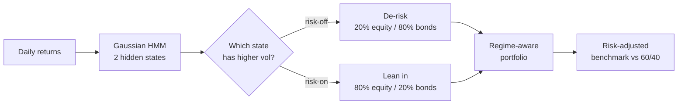

<div align="center">

# 📈 Regime-Aware Portfolio Optimizer

**Detect the market's hidden state with a Hidden Markov Model, then allocate to it.**


</div>

Markets don't move at one volatility. They flip between calm, trending "risk-on" stretches
and turbulent "risk-off" ones — and a static 60/40 portfolio is blind to the difference.
This project fits a **2-state Gaussian Hidden Markov Model** to return data, infers which
regime the market is in at each step, and shifts allocation defensively when the model
detects turbulence. It's benchmarked head-to-head against a static portfolio on
risk-adjusted terms.

---

## How it works



1. **Fit** a `GaussianHMM(n_components=2)` on the equity return series (Baum-Welch / EM).
2. **Decode** the most likely hidden-state path with the Viterbi algorithm.
3. **Label** the higher-variance state as *risk-off*.
4. **Allocate** conditionally: defensive in risk-off, aggressive in risk-on.
5. **Score** the strategy against a static 60/40 benchmark on Sharpe, Sortino, Calmar and max drawdown (`metrics.py`).

## Sample run

Synthetic two-regime data (`python regime_optimizer.py`), illustrative:

| Strategy       | CAGR   | Vol    | Sharpe | Max DD |
|----------------|:------:|:------:|:------:|:------:|
| **Regime-aware** | +4.0%  | 8.2%   | **0.49** | −6.1% |
| Static 60/40   | −0.9%  | 15.8%  | −0.05  | −21.4% |

The regime model earns a positive Sharpe at roughly half the volatility by stepping out of
the turbulent state — exactly the behavior the framework is designed to produce.

## Quickstart

```bash
pip install -r requirements.txt
python regime_optimizer.py                 # synthetic two-regime demo
python regime_optimizer.py --csv returns.csv   # your own data (cols: equity, bond)
```

## Project structure

```
regime-aware-portfolio-optimizer/
├── regime_optimizer.py   # HMM regime detection + conditional allocation
├── metrics.py            # Sharpe / Sortino / Calmar / max-drawdown
├── requirements.txt
└── README.md
```

## Extending it

- Swap the synthetic generator for real returns (`yfinance` → daily pct-change).
- Move from 2 to *k* regimes (`n_components`) and map each to a target weight vector.
- Replace the hand-set 80/20 rule with a per-regime mean-variance optimizer.
- Add transaction costs and turnover penalties before trusting any backtest.

## Notes

Default data is synthetic so the pipeline is fully reproducible offline. The transferable part
is the method — regime detection → conditional allocation → risk-adjusted benchmarking — not
the sample numbers.

<div align="center"><sub>Built by <a href="https://github.com/adrian-erlikhman">Adrian Erlikhman</a> · MIT License</sub></div>
