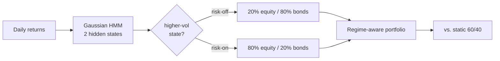

# 📈 Regime-Aware Portfolio Optimizer

 

Detect the market's hidden state with a Hidden Markov Model, then allocate to it — de-risk when it turns turbulent, benchmarked against a static 60/40.



**How** — fit a 2-state Gaussian HMM to returns, decode the regime, shift allocation defensively in the turbulent one.
**Result** — on synthetic two-regime data: **Sharpe 0.49 vs. −0.05** for static 60/40, at roughly half the volatility.

## Run
```bash
pip install -r requirements.txt
python regime_optimizer.py                     # synthetic demo
python regime_optimizer.py --csv returns.csv   # your data: cols equity, bond
```

`metrics.py` = Sharpe / Sortino / Calmar / max-drawdown. Synthetic data by default for reproducibility.

<sub>MIT · Adrian Erlikhman</sub>
